# CNN Step vs Nonstep: CNN 학습 가이드

## 이 문서의 목적

이 문서는 **CNN을 처음 공부하는 학생**을 위한 학습 가이드이다. `CNN_정리.md`에 정리한 CNN 개념(Convolution, Channel, Padding, Stride, ReLU, Pooling, Dropout, GAP, FC, Softmax)이 **실제 EMG 분류 모델에서 어떻게 적용되었는지** 연결하는 것이 목표이다.

- **연구 질문**: step과 nonstep 동작을 EMG 시계열 데이터로 구분할 수 있는가?
- **데이터**: 125 trials (step=53, nonstep=72), 24 subjects, 16 EMG 채널
- **모델**: Small 1D CNN vs Logistic Regression baseline

---

## 1. 모델 아키텍처 — CNN_정리.md 개념 매핑

> **Figure**: `figures/00_model_architecture.png`

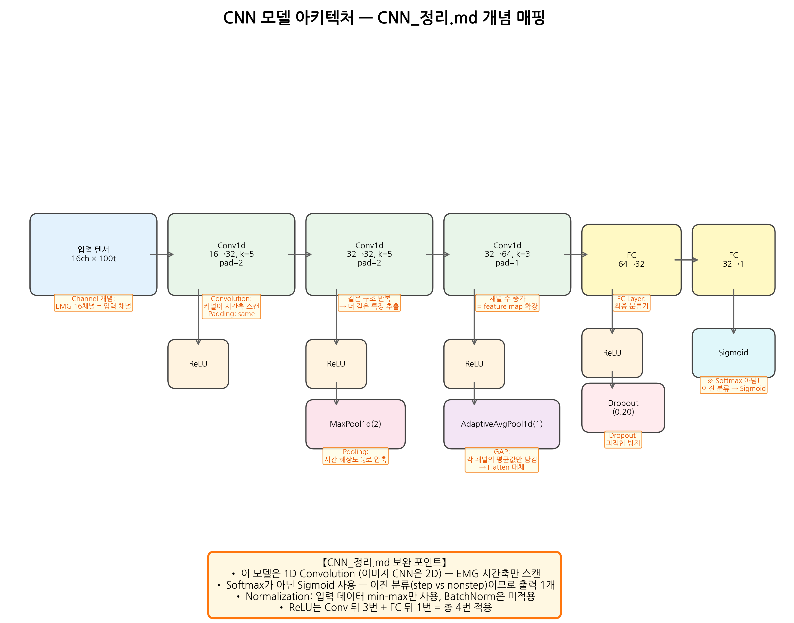

아래 표는 `CNN_정리.md`에서 정리한 개념이 이 모델의 어디에 적용되었는지 보여준다.

| CNN_정리.md 개념 | 실제 코드 (`analyze_cnn_step_nonstep.py:122-146`) | 차이점/보완 |
|---|---|---|
| Convolution (3D tensor) | `Conv1d(16→32, k=5, pad=2)` 등 3개 층 | 이미지=2D Conv, EMG=**1D Conv** (시간축만 스캔) |
| Channel | 입력 16 EMG → 32 → 32 → 64 feature map | 동일 개념. EMG 채널 = CNN 입력 채널 |
| Padding | `pad=2, 2, 1` (same padding) | 정리.md 설명 그대로 적용됨 |
| Stride | 기본값 `1` (명시 안 함 = default) | 동일 |
| ReLU | Conv 뒤 3번 + FC 뒤 1번 = **총 4번** | 동일: `f(x) = max(0, x)` |
| Pooling | `MaxPool1d(2)` + `AdaptiveAvgPool1d(1)` | 두 종류 동시 사용 (아래 §3.4 참조) |
| Dropout | FC 사이 `p=0.20` | 동일: 학습 시 뉴런 20% off |
| GAP / Flattening | `AdaptiveAvgPool1d(1)` | 정리.md 설명 그대로. Flatten 대신 GAP 사용 |
| FC layer | `64→32→1`, 2개 층 | 동일: 최종 분류기 |
| **Softmax** | **미사용. `BCEWithLogitsLoss` → sigmoid** | **보완 필요** (§3.7 참조) |
| Normalization | 입력 min-max만, BatchNorm 미사용 | 두 가지 의미 구분 필요 (§7 참조) |

**모델 전체 흐름** (코드 참조: `analyze_cnn_step_nonstep.py:122-146`):

```
입력 (16ch × 100t)
→ Conv1d(16→32, k=5, pad=2) → ReLU
→ Conv1d(32→32, k=5, pad=2) → ReLU → MaxPool1d(2)
→ Conv1d(32→64, k=3, pad=1) → ReLU → AdaptiveAvgPool1d(1) [=GAP]
→ Flatten → FC(64→32) → ReLU → Dropout(0.20) → FC(32→1)
→ BCEWithLogitsLoss (내부에서 sigmoid 적용)
```

---

## 2. 데이터 이해

### 2.1 데이터 분포 — Figure 01

> **Figure**: `figures/01_dataset_label_counts.png`

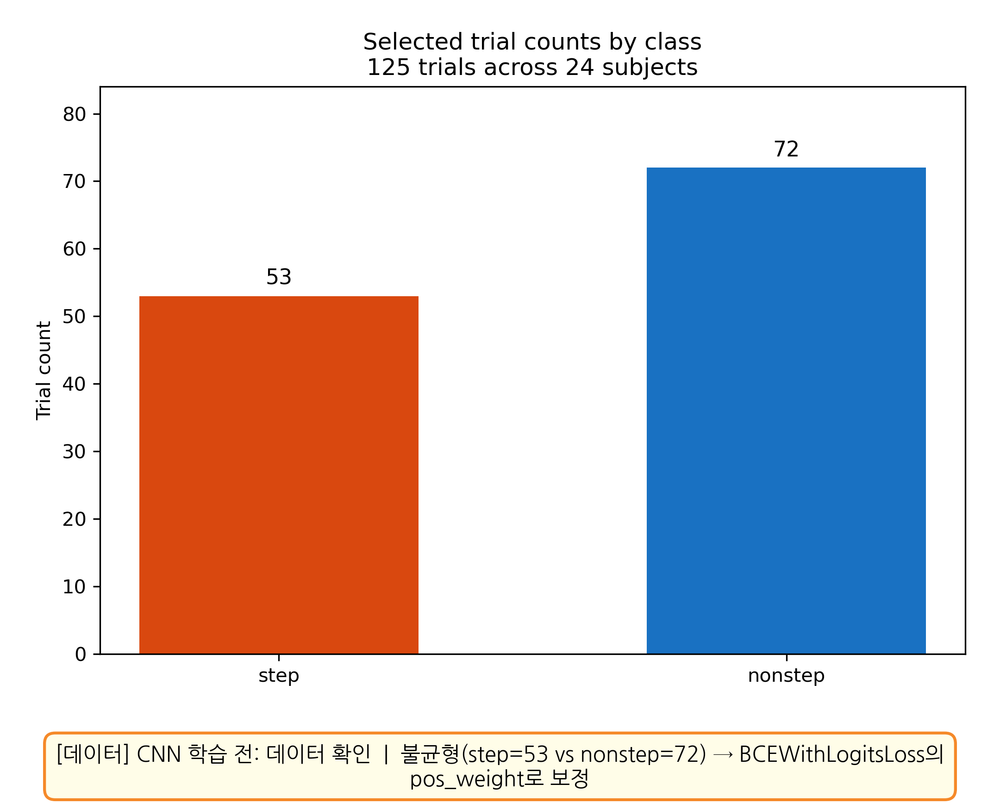

step=53, nonstep=72로 불균형이 있다. 이 불균형은 `BCEWithLogitsLoss`의 `pos_weight` 파라미터로 보정한다.

**이 그림에서 배울 수 있는 CNN 개념**: CNN 학습 전에 데이터의 클래스 분포를 확인해야 한다. 불균형 데이터는 모델이 다수 클래스만 예측하는 편향을 만들 수 있다.

### 2.2 CNN 입력 텐서 — Figure 02 ← Channel 개념

> **Figure**: `figures/02_emg_class_average_heatmaps.png`

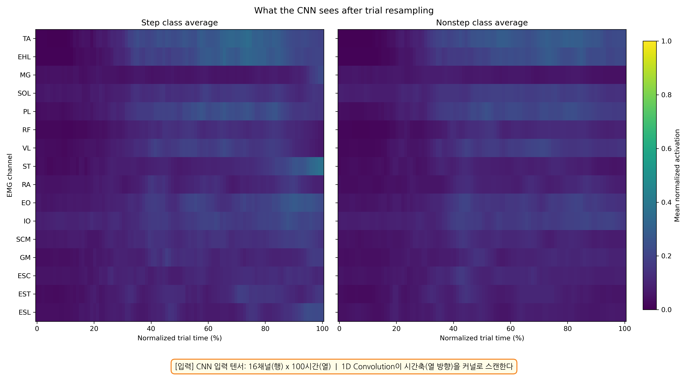

CNN의 입력은 `(trial, 16 channels, 100 time steps)` 형태의 텐서이다.

- **행(16개)** = EMG 채널 = CNN_정리.md에서 말하는 **Channel**
- **열(100개)** = 시간 축 = **1D Convolution이 스캔하는 방향**
- 이미지 CNN은 가로×세로를 2D로 스캔하지만, EMG CNN은 시간축만 1D로 스캔한다

**이 그림에서 배울 수 있는 CNN 개념**: CNN 입력이 반드시 이미지(2D)일 필요는 없다. 시계열 데이터도 채널 × 시간의 2D 텐서로 구성하면 1D CNN으로 분석할 수 있다.

### 2.3 리샘플링 필요성 — Figure 03

> **Figure**: `figures/03_trial_length_by_class.png`

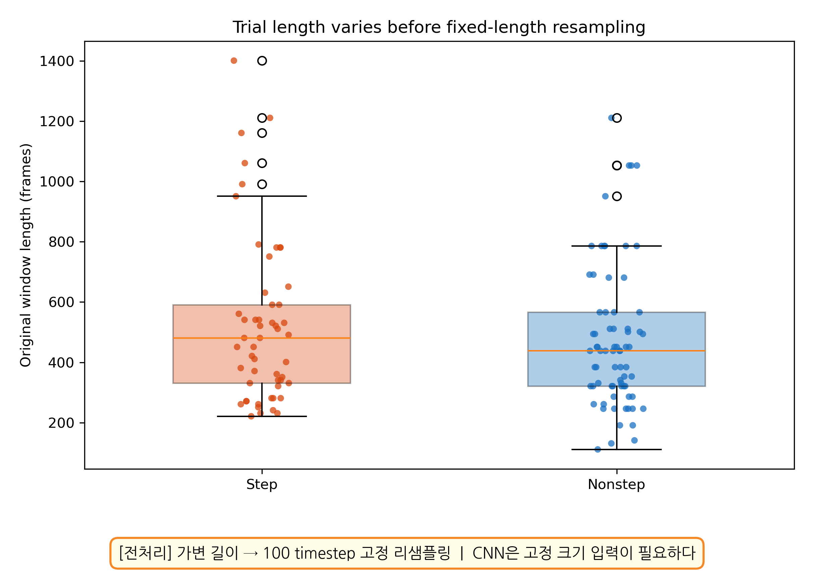

원본 시행(trial)의 길이가 제각각이다. CNN은 **고정 크기 입력**이 필요하므로, 모든 시행을 100 time step으로 리샘플링한다.

**이 그림에서 배울 수 있는 CNN 개념**: CNN의 Conv/Pool 연산은 고정 크기 텐서를 전제한다. 가변 길이 데이터는 전처리 단계에서 고정 길이로 변환해야 한다.

---

## 3. CNN 구조 상세 — 각 개념별 설명

이 절에서는 `CNN_정리.md`의 각 개념을 실제 코드와 연결하여 설명한다.

### 3.1 1D Convolution — 이미지 CNN과의 차이

```python
# analyze_cnn_step_nonstep.py:128
nn.Conv1d(in_channels, 32, kernel_size=5, padding=2)
```

- `CNN_정리.md`에서 배운 Convolution은 이미지(2D)에서 커널이 가로+세로를 스캔한다
- 이 모델은 **1D Convolution**: 커널이 **시간축 한 방향만** 스캔한다
- `kernel_size=5`: 한 번에 5개 time step을 보는 커널
- 입력 16채널 → 출력 32채널: 32개의 서로 다른 커널이 각각 다른 특징을 추출

### 3.2 Padding

```python
# Conv1: padding=2, Conv2: padding=2, Conv3: padding=1
```

- `CNN_정리.md` 설명 그대로: 가장자리(edge)가 적게 연산되는 것을 방지
- `padding=2` + `kernel_size=5` → **same padding** (출력 크기 = 입력 크기)
- `padding=1` + `kernel_size=3` → 역시 same padding

### 3.3 ReLU

```python
# 총 4번 사용: Conv 뒤 3번 + FC 뒤 1번
nn.ReLU()  # f(x) = max(0, x)
```

- `CNN_정리.md` 설명 그대로: 양수 값(특징)만 남기고 나머지는 0으로 변환
- 비선형성을 추가하여 CNN이 복잡한 패턴을 학습할 수 있게 한다

### 3.4 Pooling: MaxPool + GAP — 두 종류 동시 사용

```python
nn.MaxPool1d(kernel_size=2)       # 시간 해상도 ½로 압축 (100→50)
nn.AdaptiveAvgPool1d(1)           # GAP: 채널당 평균값 1개만 남김 (50→1)
```

- **MaxPool1d(2)**: `CNN_정리.md`의 Pooling 개념. 2개 중 최대값만 남겨 시간축 압축
- **AdaptiveAvgPool1d(1)**: `CNN_정리.md`의 **GAP** 개념. 각 채널의 전체 평균값만 FC layer에 전달
- 이 모델은 MaxPool과 GAP를 **모두** 사용한다

### 3.5 Dropout

```python
nn.Dropout(p=0.20)  # FC 층 사이에 위치
```

- `CNN_정리.md` 설명 그대로: 학습 시 뉴런 20%를 무작위로 off
- FC layer 사이에 위치하여 과적합 방지
- 추론(inference) 시에는 모든 뉴런 활성화

### 3.6 FC Layer

```python
nn.Linear(64, 32)   # 첫 번째 FC
nn.Linear(32, 1)    # 두 번째 FC → 최종 출력 (1개)
```

- GAP 출력(64차원) → 32차원 → **1차원** (이진 분류)
- `CNN_정리.md`의 "neural layer에서의 final layer" 설명과 동일

### 3.7 왜 Softmax가 아니라 Sigmoid인가?

> **이것은 CNN_정리.md에서 보완이 필요한 핵심 포인트이다.**

`CNN_정리.md`에서는 Softmax를 "classification 모델의 가장 마지막에 붙는 함수"로 설명했다. 이것은 **다중 클래스 분류**에서 맞는 말이다. 그러나:

| 분류 유형 | 출력 수 | 마지막 함수 | 손실 함수 |
|---|---|---|---|
| 다중 클래스 (개, 고양이, 새) | N개 | **Softmax** | CrossEntropyLoss |
| **이진 분류 (step vs nonstep)** | **1개** | **Sigmoid** | **BCEWithLogitsLoss** |

이 모델은 step/nonstep **2가지만** 구분하므로:
- 출력이 **1개** (step일 확률)
- Softmax 대신 **Sigmoid** 사용: `σ(x) = 1/(1+e^(-x))`
- `BCEWithLogitsLoss`가 내부에서 sigmoid를 적용하므로, 모델 코드에는 sigmoid가 명시되지 않는다

---

## 4. 학습 과정

### 4.1 Training Curves — Figure 10 ← Weight 최적화, 과적합

> **Figure**: `figures/10_training_curves.png`

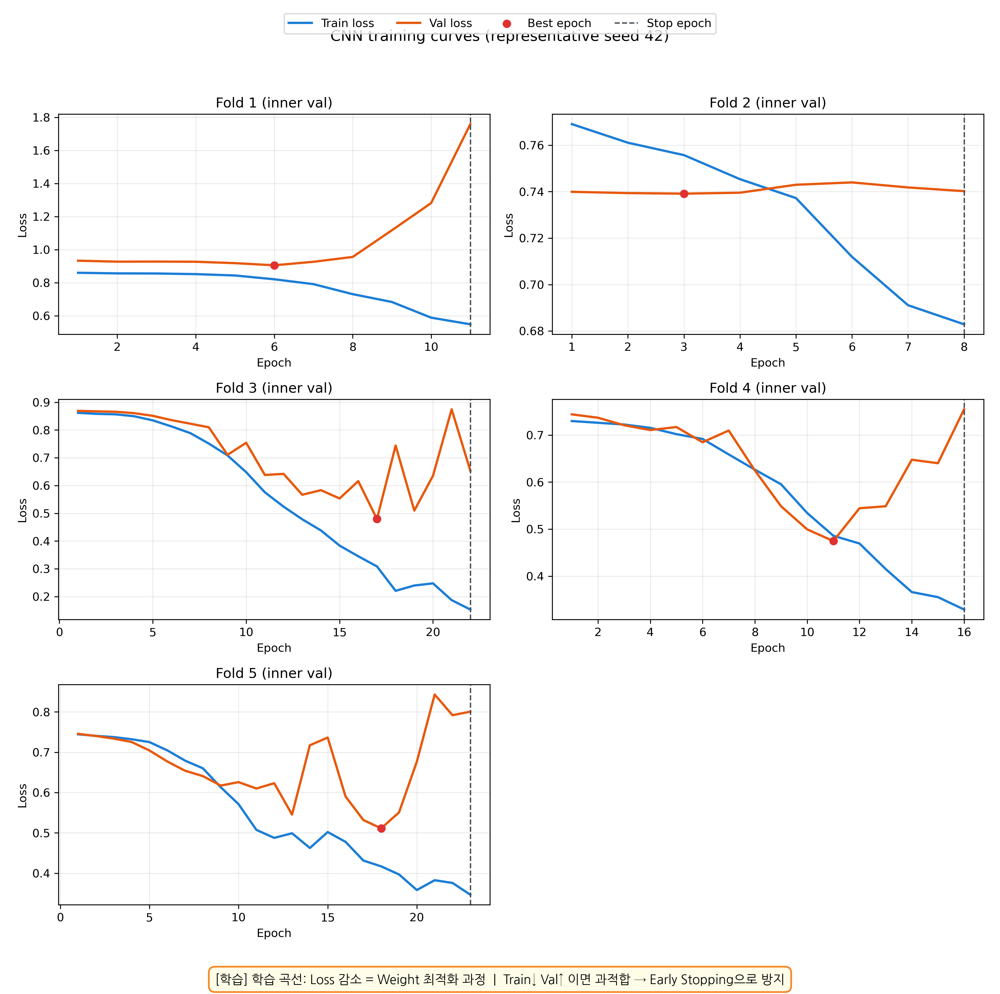

- **Train loss 감소** = weight가 최적화되고 있다 (`CNN_정리.md` §1.2: "학습을 통해 weight 자동 조절")
- **Val loss 증가** = 과적합 시작 → **Early Stopping**으로 학습 중단
- 각 fold별 패널에서 stopping point(빨간 점)가 표시됨
- 평균 best epoch ≈ 11.3, 평균 stopping epoch ≈ 16.3

**이 그림에서 배울 수 있는 CNN 개념**: Weight는 학습 과정에서 점진적으로 최적화된다. 그러나 너무 오래 학습하면 훈련 데이터에만 맞게 되어(과적합), 새로운 데이터에 대한 성능이 떨어진다.

### 4.2 Seed 영향 — Figure 07 ← Weight 랜덤 초기화

> **Figure**: `figures/07_multi_seed_metric_distribution.png`

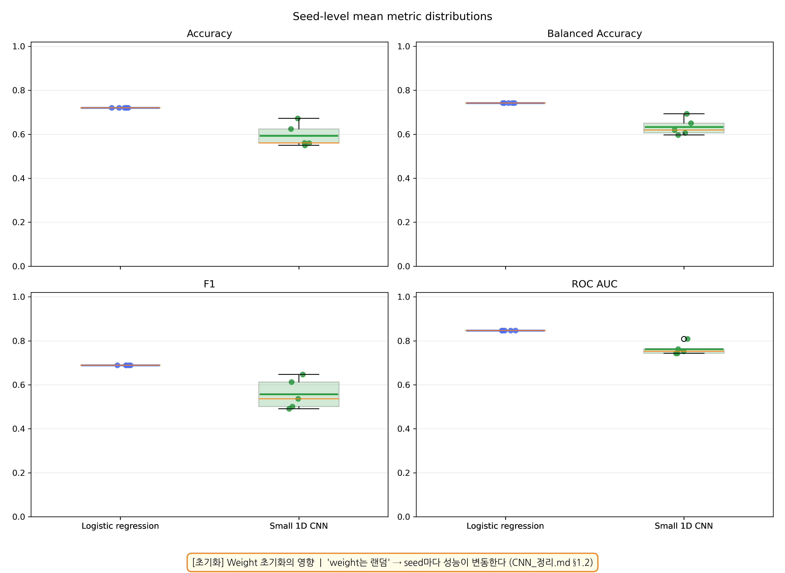

- `CNN_정리.md` §1.2: "weight는 **랜덤**이지만, 학습을 통해 조절"
- 이 랜덤 초기값(seed)에 따라 CNN 성능이 변동한다
- 5개 seed (42, 123, 456, 789, 1024)로 실험한 결과, CNN은 seed마다 성능 차이가 크다
- Logistic Regression은 seed에 무관하게 안정적

**이 그림에서 배울 수 있는 CNN 개념**: Weight의 랜덤 초기화가 최종 성능에 영향을 미친다. 한 번의 실험만으로 모델 성능을 판단하면 안 된다.

---

## 5. 평가 결과

### 5.1 Fold별 비교 — Figure 04

> **Figure**: `figures/04_fold_metric_comparison.png`

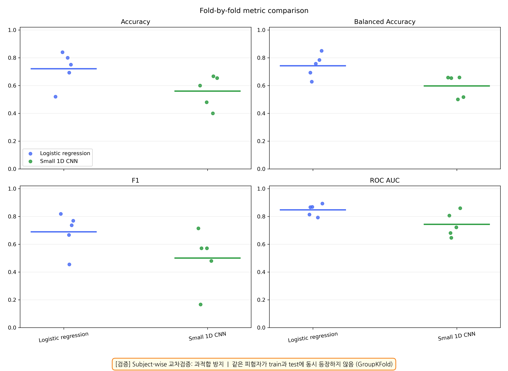

Subject-wise `GroupKFold` 교차검증: 같은 피험자가 train과 test에 동시 등장하지 않는다.

**이 그림에서 배울 수 있는 CNN 개념**: 교차검증은 모델의 일반화 성능을 측정하는 표준 방법이다. 의료/생체 데이터에서는 피험자 단위로 분리해야 데이터 누수를 방지할 수 있다.

### 5.2 Confusion Matrix — Figure 05

> **Figure**: `figures/05_confusion_matrices.png`

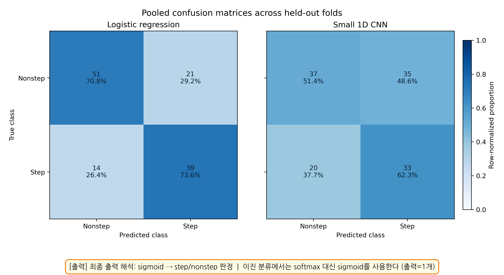

Sigmoid 출력을 threshold=0.5로 판정하여 step/nonstep을 분류한 결과이다.

### 5.3 ROC Curve — Figure 06

> **Figure**: `figures/06_pooled_roc_curves.png`

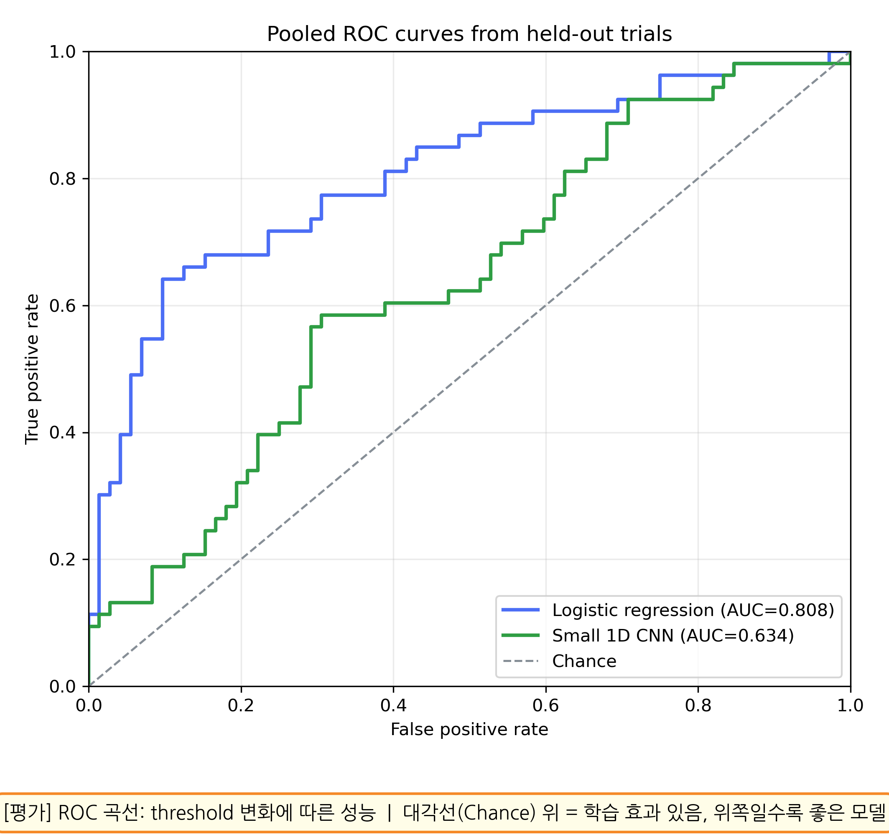

ROC AUC는 threshold를 변화시키면서 모델의 전반적 판별 성능을 측정한다. 대각선(Chance) 위에 있으면 학습 효과가 있다는 의미이다.

### 5.4 최종 결과 (Leakage-free, 5 seeds)

| Model | Accuracy | Balanced Accuracy | F1 | ROC AUC |
|------|----------|-------------------|----|---------|
| Logistic regression | 0.720 ± 0.000 | 0.742 ± 0.000 | 0.689 ± 0.000 | 0.847 ± 0.000 |
| Small 1D CNN | 0.594 ± 0.053 | 0.633 ± 0.039 | 0.558 ± 0.069 | 0.762 ± 0.027 |

현재 설정에서 Logistic Regression이 CNN보다 안정적이고 성능이 높다. 이는 데이터 크기(125 trials)가 작아서 CNN의 복잡한 파라미터를 충분히 학습시키기 어렵기 때문일 수 있다.

---

## 6. CNN이 학습한 것

### 6.1 Grad-CAM: 시간축 주목 구간 — Figure 08

> **Figure**: `figures/08_gradcam_time_saliency.png`

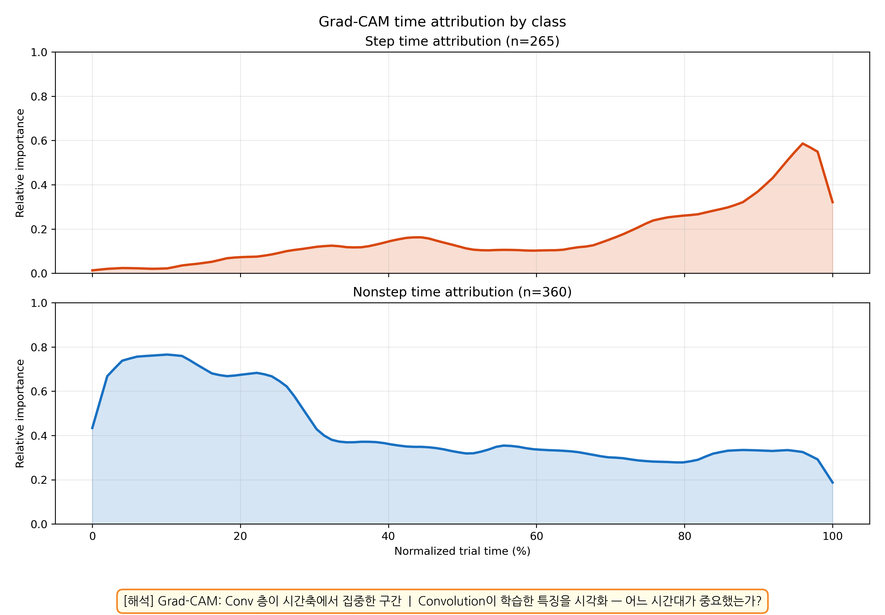

Grad-CAM은 마지막 Conv 층의 gradient를 이용하여 **CNN이 시간축에서 어디에 집중했는지** 시각화한다.

**이 그림에서 배울 수 있는 CNN 개념**: Convolution 커널은 학습을 통해 특정 시간 패턴에 반응하게 된다. Grad-CAM은 이 학습된 특징을 사후적으로 해석하는 도구이다.

### 6.2 Channel Importance — Figure 09

> **Figure**: `figures/09_channel_importance.png`

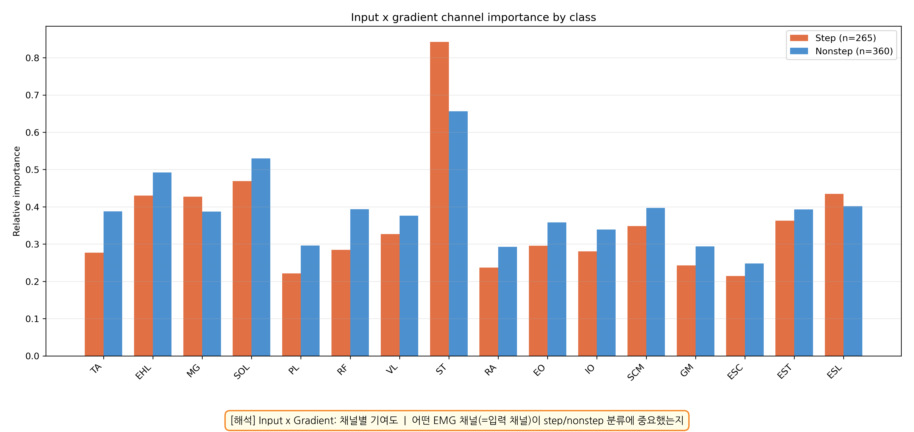

Input×Gradient 방법으로 각 EMG 채널(=입력 채널)이 분류에 얼마나 기여했는지 보여준다.

**이 그림에서 배울 수 있는 CNN 개념**: CNN의 첫 번째 Conv 층은 각 입력 채널에서 특징을 추출한다. 모든 채널이 동등하게 중요한 것은 아니며, 모델이 특정 채널에 더 많이 의존할 수 있다.

---

## 7. CNN_정리.md 보완 사항

이 분석을 통해 발견된 `CNN_정리.md`의 보완 포인트:

### 7.1 Softmax vs Sigmoid

- 정리.md: "classification 모델의 가장 마지막에 붙는 함수 = Softmax"
- **보완**: Softmax는 다중 클래스(3개 이상)용이다. **이진 분류에서는 Sigmoid를 사용**하고 출력은 1개이다.

### 7.2 1D vs 2D Convolution

- 정리.md: "input data(e.g., image)는 3D Tensor(width × height × 3)"
- **보완**: 이것은 이미지(2D Conv) 기준이다. **시계열 데이터는 1D Conv**를 사용하며, 입력은 `(channels × time)` 형태의 2D 텐서이다.

### 7.3 Normalization의 두 가지 의미

- 정리.md: "ReLU apply 전/후 데이터 정규화"
- **보완**: Normalization에는 두 가지 의미가 있다:
  1. **데이터 정규화** (이 모델: 입력 EMG에 min-max 적용) — 전처리 단계
  2. **층 정규화** (BatchNorm, LayerNorm 등) — 모델 내부에서 학습 안정화. 이 모델에서는 미사용

---

## 재현 방법

```bash
# 1. 건조 실행 (데이터 확인만)
conda run --no-capture-output -n cuda python \
  analysis/260312-0026-cnn_step_vs_nonstep/analyze_cnn_step_nonstep.py --dry-run

# 2. 단일 seed 실행
conda run --no-capture-output -n cuda python \
  analysis/260312-0026-cnn_step_vs_nonstep/analyze_cnn_step_nonstep.py \
  --seed 42 --patience 5 --cnn-epochs 50

# 3. 다중 seed 실행 (보고서 결과 재현)
conda run --no-capture-output -n cuda python \
  analysis/260312-0026-cnn_step_vs_nonstep/analyze_cnn_step_nonstep.py \
  --seeds 42,123,456,789,1024 --patience 5 --cnn-epochs 50

# 4. Figure 주석 추가
conda run -n module python \
  analysis/260312-0026-cnn_step_vs_nonstep/enhance_figures.py
```

**입력**: `configs/global_config.yaml`에 설정된 normalized EMG parquet + event workbook

**출력**:
- 11개 PNG (`figures/00_model_architecture.png` ~ `figures/10_training_curves.png`)
- stdout 메트릭 요약
